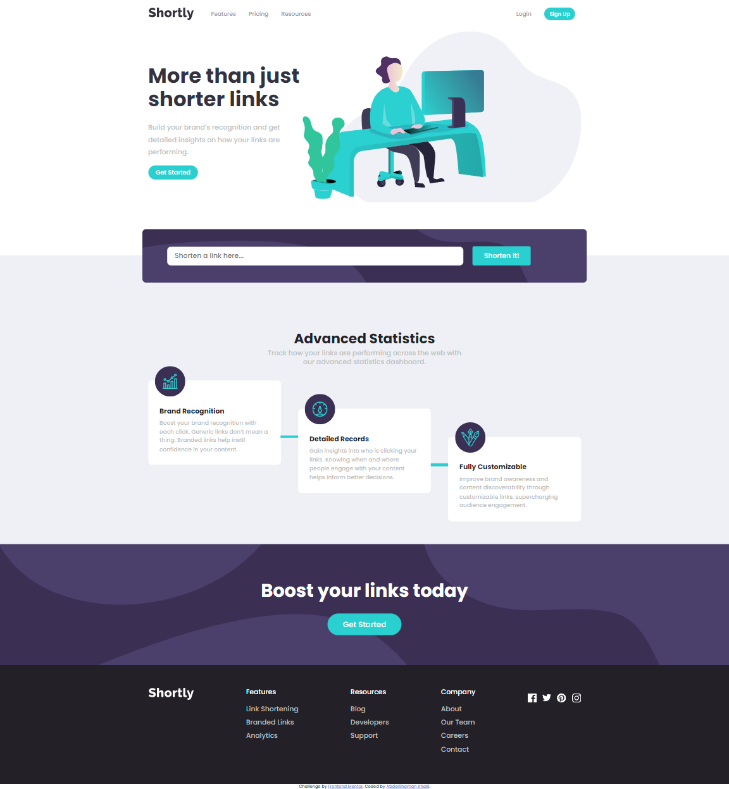

# Frontend Mentor - Shortly URL shortening API Challenge solution

This is a solution to the [Shortly URL shortening API Challenge challenge on Frontend Mentor](https://www.frontendmentor.io/challenges/url-shortening-api-landing-page-2ce3ob-G). Frontend Mentor challenges help you improve your coding skills by building realistic projects.

## Table of contents

- [Overview](#overview)
  - [The challenge](#the-challenge)
  - [Screenshot](#screenshot)
  - [Links](#links)
- [My process](#my-process)
  - [Built with](#built-with)
  - [What I learned](#what-i-learned)
- [Author](#author)

## Overview

It Was A fun App to Develop and design it.

### The challenge

Users should be able to:

- View the optimal layout for the app depending on their device's screen size
- See hover states for all interactive elements on the page
- View the optimal layout for the site depending on their device's screen size
- Shorten any valid URL
- See a list of their shortened links, even after refreshing the browser
- Copy the shortened link to their clipboard in a single click
- Receive an error message when the `form` is submitted if:
  - The `input` field is empty
  - Write invalid Url in `input`

### Screenshot



### Links

- Solution URL: [https://www.frontendmentor.io/solutions/urlshorteningapimaster-e-YHIIWyDL](https://www.frontendmentor.io/solutions/urlshorteningapimaster-e-YHIIWyDL)
- Live Site URL: [https://abdelrhmankh.github.io/url-shortening-api-master/](https://abdelrhmankh.github.io/url-shortening-api-master/)

## My process

### Built with

- Semantic HTML5 markup
- CSS custom properties
- Flexbox
- Mobile-first workflow
- JS pure

### What I learned

```Regex
const re = /(https?:\/\/)?(www)?(.\w+)+((:\d{4})?((\/|\?|\/\?|&|=|-)(\w+.?=?\w+)*))*/ig;
```

```js
if (navigator && navigator.clipboard && navigator.clipboard.writeText) {
  copyed.classList.add("copyed");
  copyed.textContent = "Copied!";
  return navigator.clipboard.writeText(e);
}
return Promise.reject("The Clipboard API is not available.");
```

## Author

- Website - [AbdelRahman Khalil](https://abdelrhmankh.github.io/abdelrhmankhalil/)
- Frontend Mentor - [@abdelrhmanKh](https://www.frontendmentor.io/profile/abdelrhmanKh)
- LinkedIn - [@Abdelrhman-khalil](https://www.linkedin.com/in/abdelrhman-khalil-ali-9716a0188/)
